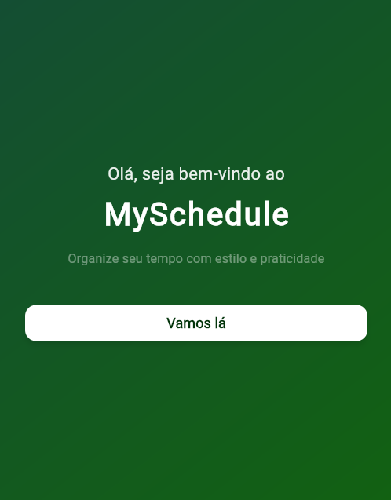
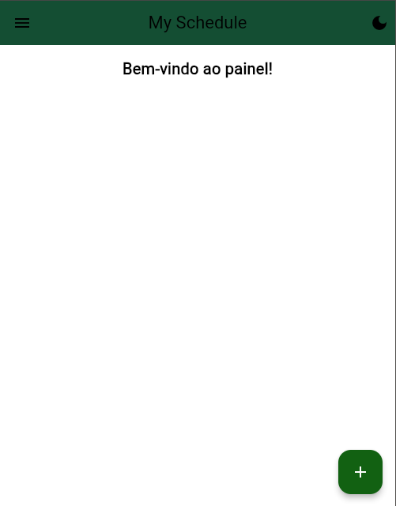
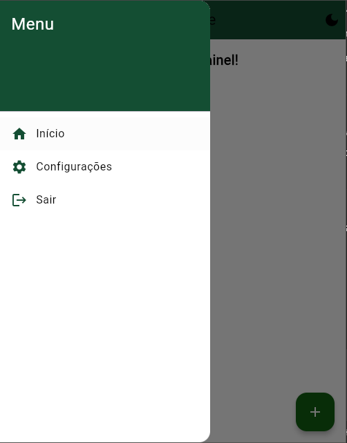
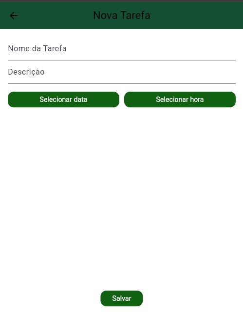
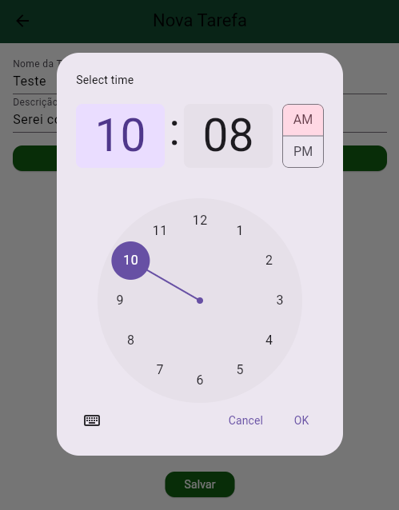
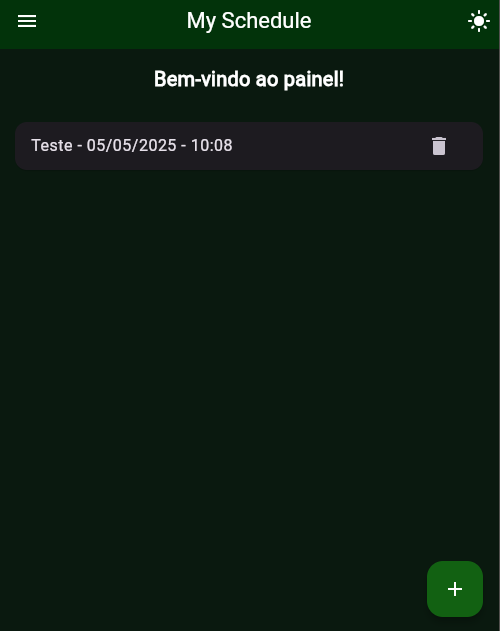
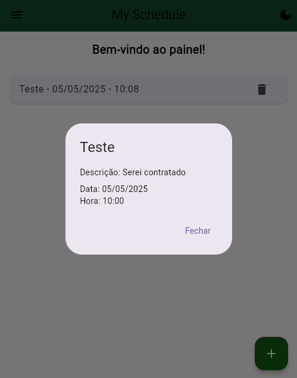
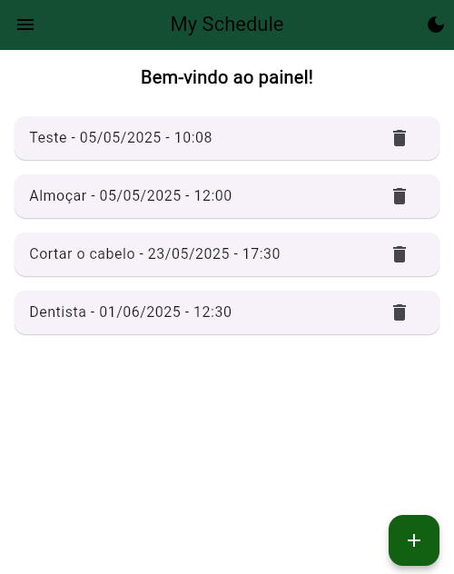

---

# My Schedule - App de Tarefas em Flutter

Esse é um aplicativo simples feito para um teste, desenvolvido em Flutter. O objetivo principal foi mostrar um pouco do meu conhecimento com Flutter, utilizando algumas boas práticas e bibliotecas que gosto.

---

## Tecnologias e Bibliotecas

* Flutter
* Provider (para gerenciamento de estado)
* Intl (para formatação de datas e horas)
* flutter\_lints (para garantir um padrão de código limpo)

---

## Estrutura do Projeto

```
lib
├── controller
│   ├── task_controller.dart
│   └── theme_controller.dart
├── models
│   └── task.dart
├── pages
│   ├── pages_internas
│   │   └── add_task_page.dart
│   ├── dashBoard_page.dart
│   └── inicial_page.dart
├── utils
│   ├── app_controller.dart
│   └── app_theme.dart
└── main.dart
```

Eu costumo usar uma estrutura parecida em vários projetos no meu trabalho, que ajuda a organizar tudo direitinho.

---

## Funcionalidades do Aplicativo

* **Tela Inicial:** Apresenta uma mensagem de boas-vindas e um botão para acessar a Dashboard.
* **Dashboard:**

  * Possui um Drawer com opções: Home, Configurações e Logout.
  * Lista de tarefas ordenada por data e hora.
  * Botão para adicionar novas tarefas.
  * Botão para alternar entre tema claro e escuro.
  * Botão para excluir tarefas.
  * Ao clicar em uma tarefa, abre uma tela com os detalhes dela.
* **Adicionar Tarefa:**

  * Campos para nome e descrição da tarefa.
  * Seleção de data e hora para agendar a tarefa.

---

## Observações

* O projeto foi feito rapidamente, mas tentei expressar o máximo do meu conhecimento em Flutter.
* Para armazenar as tarefas, optei por manter tudo local e estático, sem usar banco de dados como SQLite (poderia ser uma alternativa futura).
* Usei a IA (ChatGPT) em pontos específicos para ajudar a construir algumas funcionalidades, especialmente a parte de gerenciamento local, pois estou acostumado com gerenciamento de dados em nuvem.
* Também usei a IA para ajudar a formatar esse README, inclusive!

---

## Como rodar o projeto

1. Clone o repositório
2. Rode `flutter pub get` para instalar as dependências
3. Execute `flutter run` para rodar no dispositivo ou emulador

---

## Imagens do App

* InicialPage();


* DashBoardPage();

Drawer


* AddTask();

SelectTime


modo Dark com tarefa

descrição - PopUp

algumas tarefas a mais


---

## Próximos passos

* Subir o projeto no GitHub Pages para demo online
* Implementar armazenamento local (SQLite ou Hive)
* Melhorar a UI e adicionar mais funcionalidades

---

Obrigado por conferir! Espero que tenha curtido.
Qualquer dúvida ou sugestão, só chamar. Até mais! (assim espero kkk)

---
